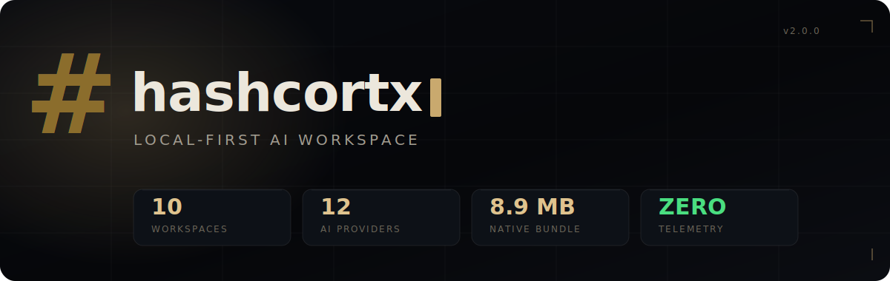
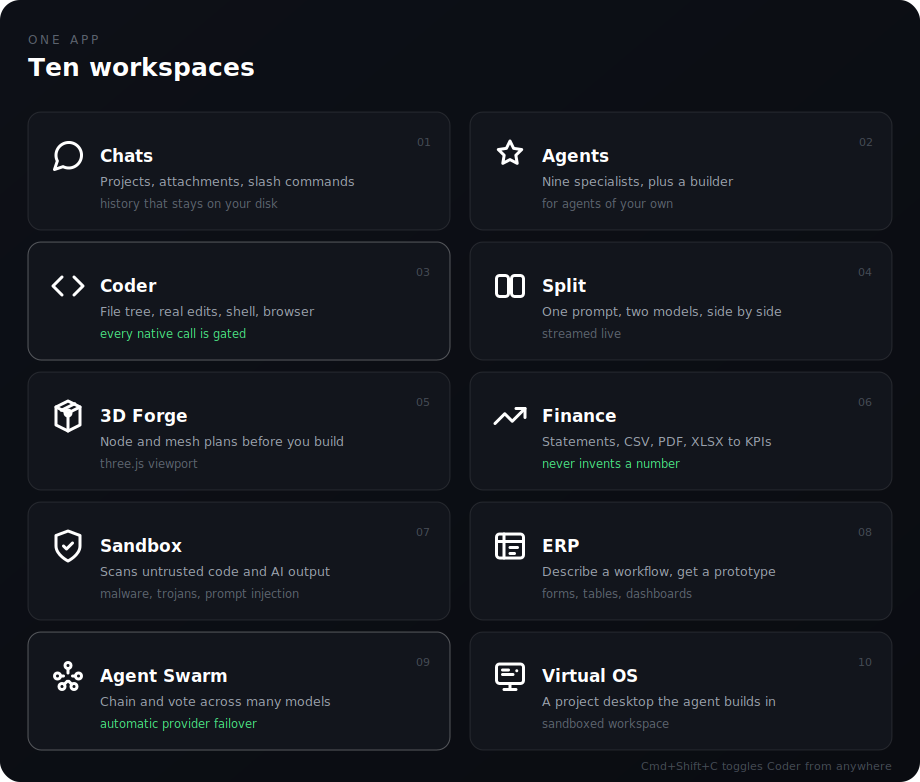
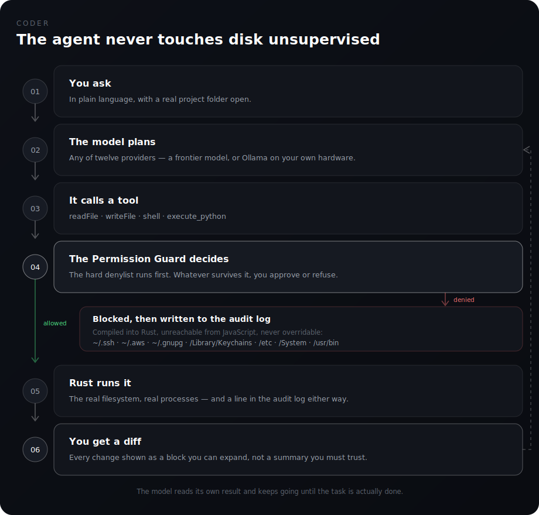
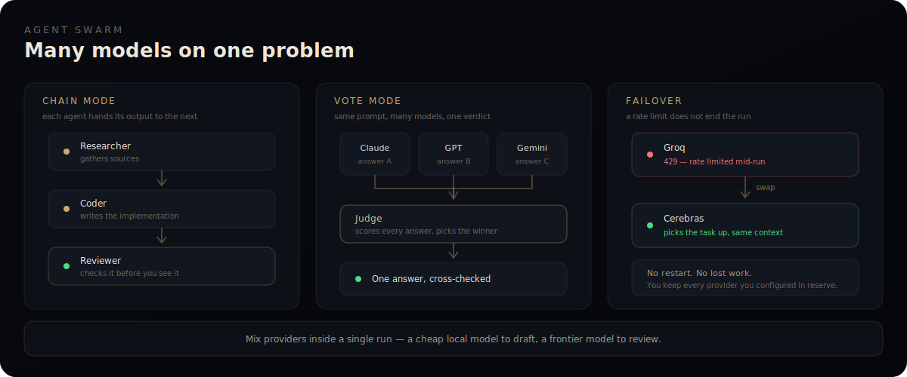
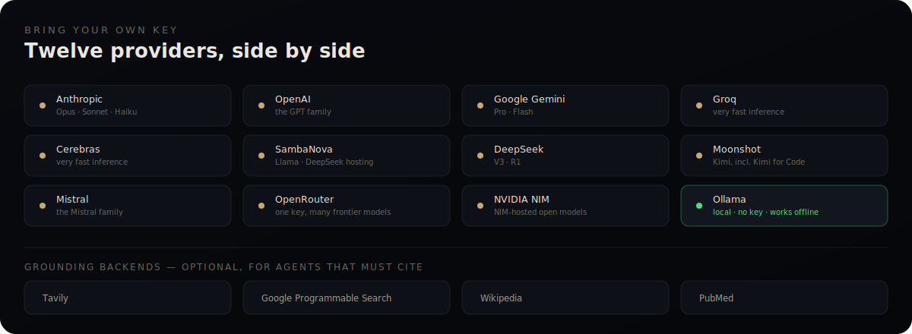
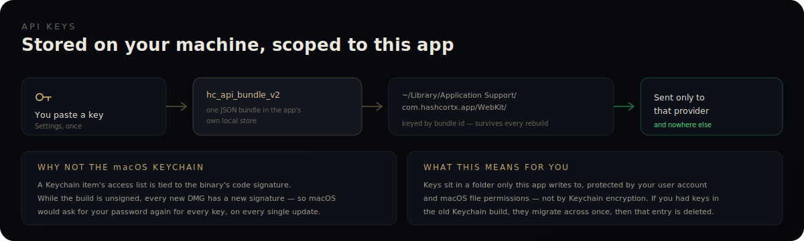
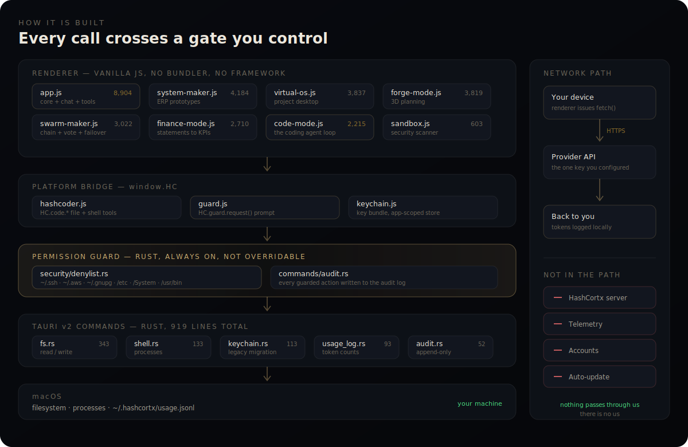

<div align="center">



<br>

**Ten workspaces. Twelve providers. Zero telemetry.**

<a href="https://trendshift.io/repositories/36185?utm_source=trendshift-badge&amp;utm_medium=badge&amp;utm_campaign=badge-trendshift-36185" target="_blank" rel="noopener noreferrer"></a>

<br>

[Website](https://hashcortx.com) · [Download](https://github.com/Hash-7777/HashCortX/releases/latest) · [Wiki](https://github.com/Hash-7777/HashCortX/wiki) · [Discussions](https://github.com/Hash-7777/HashCortX/discussions) · [Demo video](https://youtu.be/On5wPdKZDfg)


</div>

<br>


---

## What this is

HashCortx is a native macOS app that puts a multi-provider AI chat, an autonomous coding agent, multi-agent swarms, nine specialist agents, a Python sandbox, financial document analysis, a security scanner, 3D planning, and a virtual project desktop behind one window.

It is **8.9 MB**. It has **no backend, no telemetry, no account, and no auto-updater**. Every AI request goes straight from your machine to the provider whose key you entered. Nothing passes through HashCortx infrastructure, because there is no HashCortx infrastructure. Point it at Ollama and the whole app runs with the network off.

It is MIT-licensed, and you can read all of it — roughly 33,000 lines of vanilla JavaScript and 919 lines of Rust, with no bundler and no framework in between.

<br>

<table>
<tr><td width="200"><b>Type</b></td><td>Native desktop app (Tauri v2)</td></tr>
<tr><td><b>Platform</b></td><td>macOS Apple Silicon · Intel, Windows and Linux planned</td></tr>
<tr><td><b>License</b></td><td>MIT</td></tr>
<tr><td><b>Version</b></td><td>2.0.0</td></tr>
<tr><td><b>Bundle size</b></td><td>8.9 MB DMG</td></tr>
<tr><td><b>Stack</b></td><td>Rust · vanilla JavaScript · no bundler · no framework</td></tr>
<tr><td><b>AI providers</b></td><td>11 cloud + Ollama for local models</td></tr>
<tr><td><b>Workspaces</b></td><td>10, plus a no-code agent builder</td></tr>
<tr><td><b>Specialist agents</b></td><td>9 built in</td></tr>
<tr><td><b>Telemetry · backend · accounts</b></td><td>None · None · None</td></tr>
</table>

---

## Why you might want it

**Nothing phones home.** No analytics, no crash reporting, no update pings. The only outbound connections are to the AI providers you configured yourself.

**Your keys, your models.** Eleven cloud providers and Ollama, all configured at once, switched freely, and mixed inside a single swarm run.

**It fits in a pocket.** 8.9 MB, against 100–300 MB for the Electron apps in this category — roughly thirty times smaller.

**The agent asks before it acts.** File and shell calls from the coding agent hit a Rust permission gate before they run, and a hard denylist that no prompt can talk its way past.

**Ten workspaces, not ten apps.** Coding, chat, swarms, research, finance, security scanning, 3D planning, ERP prototyping, and a virtual desktop — one window, one set of keys.

**You can audit it.** MIT, no build step, no minified application code. Read it, fork it, ship your own.

---

## The ten workspaces



| | Workspace | What it does |
|---|---|---|
| 01 | **Chats** | Multi-provider chat with projects, file and image attachments, slash commands, and full history |
| 02 | **Agents** | Nine built-in specialists, plus a no-code builder for your own — name, icon, system prompt, tool set |
| 03 | **Coder** | The coding agent: file tree, project picker, real file edits, shell access, and a browser panel |
| 04 | **Split** | The same prompt sent to two models at once, streamed side by side |
| 05 | **3D Forge** | Architecture-first 3D planning — structured node and mesh plans for game levels and spatial design |
| 06 | **Finance** | Bank statements, CSV, PDF and XLSX into KPIs, charts and recommendations. Constrained never to invent a number |
| 07 | **Sandbox** | A swarm of agents scanning untrusted code or AI output for malware, trojans, prompt injection and suspicious logic |
| 08 | **ERP** | Describe a workflow, get a working interactive prototype — forms, tables, dashboards |
| 09 | **Agent Swarm** | Multi-agent pipelines with chain mode, vote mode, and automatic provider failover mid-run |
| 10 | **Virtual OS** | A simulated project desktop where an agent creates, edits and organises files in a sandboxed workspace |

Full reference: [MODES_GUIDE.txt](MODES_GUIDE.txt) · [Wiki → Features](https://github.com/Hash-7777/HashCortX/wiki/Features)

---

## Coder

The agent reads your real files, edits them, runs commands, and shows you every change as a diff you can expand. It does not get to do any of that quietly.



Every filesystem and shell call from the agent passes through `HC.guard.request()` and lands in Rust, where a compiled denylist rejects anything touching `~/.ssh`, `~/.aws`, `~/.gnupg`, `/Library/Keychains`, `/etc`, `/System`, or the system binaries. That list is not configurable and not reachable from JavaScript. Everything the guard sees, allowed or denied, is written to an audit log you can open from Settings.


---

## Agent Swarm



Chain mode hands each agent's output to the next. Vote mode runs the same prompt across several models and has a judge score the answers. If a provider rate-limits or dies in the middle of a run, the swarm swaps to another one you configured and carries on with the same context — no restart, nothing lost.


---

## The nine specialist agents

| Agent | What it is for | Tools |
|---|---|---|
| **HashCortx** | General assistant with persistent memory | memory, web search, fetch URL, datetime, calculate, Python |
| **HashCortx Lite** | Tuned for tiny local models (1.5B–3B): short prompt, no tool calling, memory still works | memory |
| **Researcher** | Multi-step research — searches, reads pages, follows up | memory, web search, Wikipedia, fetch URL, datetime, Python |
| **Deep Research** | Plans, searches, reads, cross-checks, then writes a cited brief | memory, web search, Wikipedia, fetch URL, PubMed, datetime, Python |
| **Coder** | Senior-staff coding help | memory, web search, fetch URL, datetime, calculate, Python |
| **URL Reader** | Pulls a page apart and explains it | memory, fetch URL, web search, Python |
| **Published Papers Researcher** | Literature search grounded in PubMed | memory, web search, fetch URL, Python |
| **Medical Lexi-Check** | Drug and interaction checks, source-grounded | memory, web search, fetch URL, Python |
| **ATS CV Auditor** | Audits a CV the way an applicant tracking system would | memory, web search, Python |

Build your own from the Agents tab: name it, give it an icon and a system prompt, tick the tools it is allowed to use.

### The Python tool is real Python

`execute_python` runs full CPython compiled to WebAssembly (Pyodide) inside the app, preloaded with `pandas`, `numpy`, `matplotlib`, `python-docx`, `openpyxl` and `reportlab`. Globals persist across calls within a conversation. Anything the agent writes to `/output/` downloads to your machine — so "turn this into a Word report" produces an actual `.docx`, not a description of one. The first call pulls about 10 MB and takes a few seconds; after that it is instant.

---

## Finance and 3D Forge

Finance ingests statements, CSVs, PDFs and spreadsheets and turns them into KPIs, charts and recommendations. Its system prompt forbids inventing figures — if a number is not in your document, it does not appear in the analysis.


3D Forge plans spatial work before any of it gets built — structured node and mesh plans for game levels, generative architecture and scene layout, on a three.js viewport.


---

## Providers



Bring your own key for any of the eleven cloud providers, or run Ollama and use no key at all. Each key gets a **Test** button in Settings that calls the provider's own endpoint, so you find out immediately whether it works.

The grounding backends are optional. Agents that must cite their sources use Tavily or Google Programmable Search for the web, Wikipedia for background, and PubMed for medical literature.

---

## Where your API keys live



Keys are written to a single JSON bundle (`hc_api_bundle_v2`) in the app's own local store under `~/Library/Application Support/com.hashcortx.app/`. That directory is keyed by the bundle identifier rather than by the binary, so it survives every rebuild.

**They are not in the macOS Keychain, and this is deliberate.** A Keychain item's access list is bound to the binary's code signature. While the build is unsigned, every new DMG carries a new signature, which would make macOS ask for your password once per key on every single update. The Rust Keychain implementation still ships ([`src-tauri/src/commands/keychain.rs`](src-tauri/src/commands/keychain.rs)); on first run it pulls any keys out of the old Keychain bundle, copies them across, and deletes the entry so it never prompts again.

What this means in practice: your keys sit in a directory only this app writes to, protected by your macOS user account and file permissions — not by Keychain encryption. That is a real difference, and it is stated plainly here rather than dressed up. Code signing is on the roadmap, and Keychain storage becomes practical again the moment it lands.

---

## Install

Download `HashCortx-2.0.0-macOS-arm64.dmg` from the [latest release](https://github.com/Hash-7777/HashCortX/releases/latest), open it, and drag HashCortx to `/Applications`.

The build is unsigned, so on first launch right-click the app and choose **Open**, then **Open** again. If macOS still refuses:

```bash
xattr -dr com.apple.quarantine /Applications/HashCortx.app
```

Then open **Settings → Providers**, add a key for whichever provider you want, and press **Test**. Or skip keys entirely and point it at a local Ollama server.

### Build from source

```bash
git clone https://github.com/Hash-7777/HashCortX.git
cd HashCortX
npm install
npm run tauri dev      # live-reload development
npm run tauri build    # DMG in src-tauri/target/release/bundle/dmg/
```

Requires macOS, Node 18+, a Rust toolchain via `rustup`, and Xcode Command Line Tools.

---

## Under the hood



| Layer | Technology |
|---|---|
| **Shell** | Tauri v2 — Rust core, the system webview, no Chromium |
| **Backend** | Rust: filesystem, shell, audit log, token usage log, Keychain migration |
| **Security** | Compiled denylist in `security/denylist.rs`, permission prompt via `HC.guard.request()` |
| **Frontend** | Vanilla JavaScript. No React, no TypeScript, no bundler, no build step |
| **Vendored libs** | marked, highlight.js, DOMPurify, mermaid, pdf.js, jsPDF, three.js — all local, no CDN |
| **Python** | Pyodide (CPython on WebAssembly) with pandas, numpy, matplotlib, python-docx, openpyxl, reportlab |
| **Local models** | Ollama, with saved endpoint presets |

Vanilla JS with no bundler is a deliberate constraint, not an oversight. It is what keeps the bundle at 8.9 MB, and it lets any reader follow a feature from the button that triggers it to the Rust function that performs it, without a source map.

Design notes: [docs/ARCHITECTURE.md](docs/ARCHITECTURE.md) · [docs/SECURITY.md](docs/SECURITY.md)

---

## Privacy and security

**No backend server.** Every AI request goes from your machine to the provider you configured. There is no intermediary to trust.

**No telemetry.** No analytics, no tracking, no usage reporting, no error reporting. The binary makes no network call except to the provider endpoints you set up.

**No accounts, no auto-updater.** Nothing to sign up for. Nothing that reaches out on its own.

**A permission gate in Rust.** The coding agent's filesystem and shell calls are intercepted before execution. Sensitive paths are denied unconditionally. Every guarded action is logged.

**Source-grounded modes.** Published Papers Researcher, Medical Lexi-Check and Finance are constrained never to fabricate data — a rule informed by the author's pharma background.

**Air-gapped capable.** With Ollama, turn the network off and everything still works.

**A usage log that stays put.** HashCortx appends real token counts to `~/.hashcortx/usage.jsonl` on your disk, which [HashMeterAi](https://github.com/Hash-7777/HashMeterAi) can read.

---

## How it compares

Best effort as of July 2026. If something here is out of date, please [open an issue](https://github.com/Hash-7777/HashCortX/issues/new/choose) and it will be corrected.

| | HashCortx | Cursor | Claude Code | Continue | Aider | Cline | Zed |
|---|---|---|---|---|---|---|---|
| Type | Native app | VS Code fork | CLI | Editor extension | Terminal CLI | VS Code extension | Native editor |
| License | MIT | Proprietary | Proprietary | Apache 2.0 | Apache 2.0 | Apache 2.0 | GPL/AGPL |
| Free | Yes, bring your own key | Subscription | Subscription or API | Yes | Yes | Yes | Yes |
| Cloud providers | 11 | Limited | Anthropic only | Many | Many | Many | Several |
| Local models (Ollama) | Yes | Limited | No | Yes | Yes | Yes | Yes |
| Multi-agent swarms | Yes | No | No | No | No | No | No |
| Workspaces beyond coding | 10 | No | No | No | No | No | No |
| Built-in specialist agents | 9 | None | None | None | None | None | None |
| Telemetry | None | Yes | Opt-out | Opt-in | None | None | Opt-in |

---

## Keyboard shortcuts

| Shortcut | Action |
|---|---|
| `Cmd/Ctrl + Shift + C` | Toggle Coder from anywhere, and back again to where you were |
| `Cmd/Ctrl + Shift + N` | New chat |
| `Cmd/Ctrl + K` | Jump to the model picker |

---

## FAQ

**Is it free?** Yes. MIT, no paid tier, no usage caps. You pay the AI providers directly, or you pay nothing at all and use Ollama.

**Does it work offline?** Yes, with Ollama. Cloud providers need the internet.

**Which systems?** macOS Apple Silicon today. Intel Mac, Windows and Linux are planned — Tauri supports all three, so the remaining work is packaging and testing.

**Does it send my code anywhere?** Only to the provider you configured, when you send a message. There is no HashCortx server.

**Can I use Claude, GPT and Gemini at once?** Yes, and inside the same swarm run. Configure every key and switch freely.

**Are my API keys encrypted?** No. They live in an app-scoped local directory protected by your macOS user account, not by Keychain encryption. [Here is the reasoning.](#where-your-api-keys-live)

**Why is it so small?** No Chromium, no Electron, no React, no bundler. Tauri uses the webview macOS already ships with.

**Was it built with AI?** Yes, heavily. See below.

More at [Wiki → FAQ](https://github.com/Hash-7777/HashCortX/wiki/FAQ).

---

## Roadmap

- Code signing and notarisation for the macOS build, which also unlocks Keychain key storage
- Intel Mac, Windows and Linux builds
- Continued extraction of `app.js` into focused modules
- Permission Guard coverage for Virtual OS and 3D Forge native calls
- More specialist agents, driven by what people ask for

Suggest something in [Issues](https://github.com/Hash-7777/HashCortX/issues/new/choose) or [Discussions](https://github.com/Hash-7777/HashCortX/discussions).

---

## How this was built

**Every product decision is the author's.** The ten-workspace structure, the local-first rule, the Permission Guard and audit model, the swarm failover pattern, and the source-grounding constraints in the medical and finance modes were conceived and directed by a human.

**The implementation leaned hard on AI — roughly 30 million tokens** across Claude, GPT and other frontier models during the v2.0.0 build. AI wrote most of the code, under human architecture, review and correction.

This is disclosed because HashCortx is itself an AI tool. Using AI to build it and hiding that would be incoherent. Every line is public and reviewable at [Hash-7777/HashCortX](https://github.com/Hash-7777/HashCortX).

---

## The Hash ecosystem

Three local-first apps, same principles — no cloud, no telemetry, your data stays where it is.

| | |
|---|---|
| **[HashCortx](https://github.com/Hash-7777/HashCortX)** *(this one)* | The local-first AI workspace |
| **[HashCerebrum](https://github.com/Hash-7777/HashCerebrum)** | A medical-research workbench with a 3D brain interface for searching, citing and peer-reviewing papers |
| **[HashMeterAi](https://github.com/Hash-7777/HashMeterAi)** | An honest local usage meter — how much AI you actually use |

HashCortx writes its token usage to `~/.hashcortx/usage.jsonl`, which HashMeterAi reads, so your spend across the whole ecosystem is measured in one place.

---

## Contributing

Read [CONTRIBUTING.md](CONTRIBUTING.md) for setup and the architecture rules. Bugs and features go in [Issues](https://github.com/Hash-7777/HashCortX/issues); questions and ideas in [Discussions](https://github.com/Hash-7777/HashCortX/discussions).

## License

MIT. See [LICENSE](LICENSE).

## Author

**Seif Hashish** — independent open-source developer with a pharma and clinical background, which is where the refusal-to-fabricate constraints in the medical and finance modes come from.

[@Hash-7777](https://github.com/Hash-7777) · [hashcortx.com](https://hashcortx.com)

---

<div align="center">

<br>

**HashCortx**

One window · Twelve providers · Zero data leak · Local-first · MIT

[Download](https://github.com/Hash-7777/HashCortX/releases/latest) · [Wiki](https://github.com/Hash-7777/HashCortX/wiki) · [Discussions](https://github.com/Hash-7777/HashCortX/discussions)

<br>

</div>
