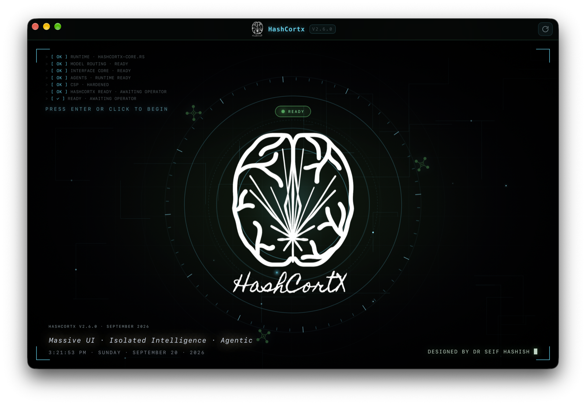
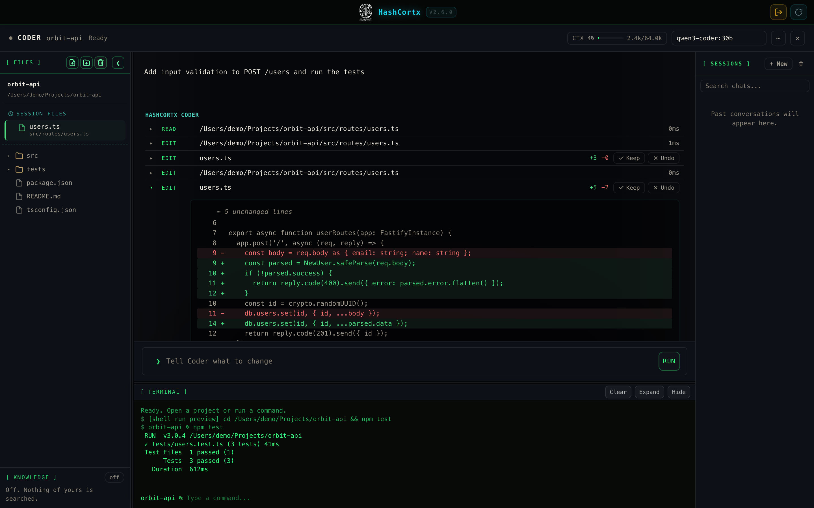
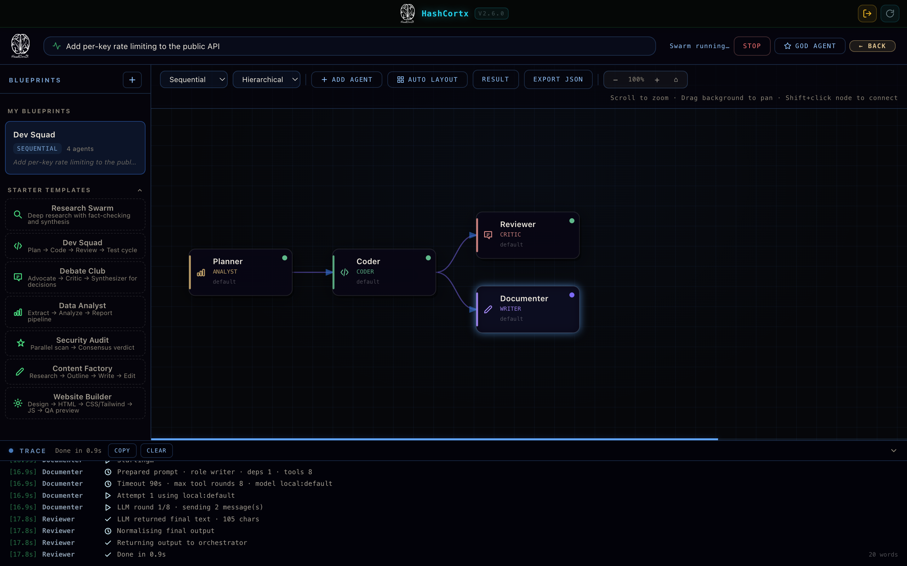
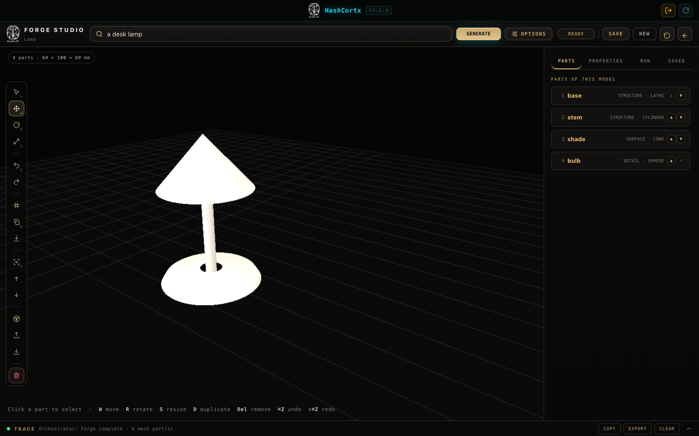
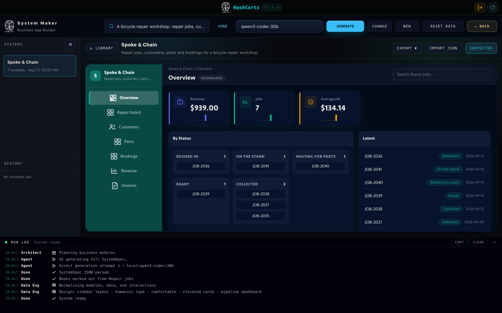
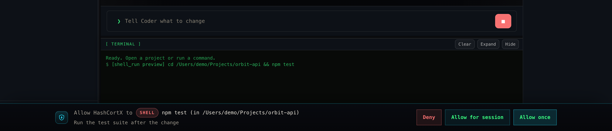

<div align="center">


# HashCortx

**The local-first AI workspace.**

Chat, a coding agent, agent teams and five more workspaces in one desktop app.<br>
Your keys, your models, your machine. No backend, no telemetry, no account.

<a href="https://github.com/Hash-7777/HashCortX/releases/latest"></a>
<a href="https://hashcortx.com"></a>
<a href="https://youtu.be/On5wPdKZDfg"></a>
<a href="https://github.com/Hash-7777/HashCortX/wiki"></a>
<a href="https://news.ycombinator.com/item?id=49516181"></a>
<a href="https://github.com/Hash-7777/HashCortX/discussions"></a>

<a href="https://github.com/Hash-7777/HashCortX/actions/workflows/ci.yml"></a>


<br>

<a href="https://trendshift.io/repositories/36185?utm_source=trendshift-badge&amp;utm_medium=badge&amp;utm_campaign=badge-trendshift-36185" target="_blank" rel="noopener noreferrer"></a>

</div>

<br>



<br>

## Why HashCortx

- **Nothing phones home.** No analytics, no crash reports, no update checks. Every connection is for work you asked for, and [SECURITY.md](docs/SECURITY.md) lists each address.
- **Any model, all at once.** Eleven cloud providers, Ollama, and any other model app on your computer that serves the common chat format, side by side, with your own keys. Run fully local when you want to.
- **An agent that asks first.** Commands, deletions, web pages it picks and anything outside your project need your approval. Every file change is a diff you can keep or undo.
- **Readable to the last line.** MIT licensed. Vanilla JavaScript and Rust, no bundler, no minified app code.

> This page describes `main`. Changes made since v2.6.0 reach the download with the next release; the [changelog](CHANGELOG.md) lists them.

## Eight workspaces

| Workspace | What it does |
|---|---|
| **Chats** | Multi-provider chat with projects, attachments, memory and a local knowledge base |
| **Coder** | A coding agent on your real project: file tree, edits as diffs, terminal, Undo |
| **3D Forge** | Describe a part, get a dimensioned solid. Exports STL, OBJ, 3MF and STEP in millimetres |
| **Finance** | Statements, CSV, PDF and XLSX read into a list of figures, with every total, card and chart worked out by the app from that list, and updated when you edit it |
| **Sandbox** | Agents that inspect untrusted code for malware, prompt injection and suspicious logic |
| **ERP** | Tell its agent about your business; it builds a working app with linked records and books, then changes it, updates its records and answers questions about them when you ask. Exported as one HTML file |
| **Agent Swarm** | Teams of agents in chain or vote, on any mix of models, with past runs to reopen |
| **Virtual OS** | A simulated project desktop an agent builds inside |

Plus **Agents**, nine built-in specialists and a builder for your own, and **Split**, one prompt answered by two models side by side.

## Coder

The agent works on your real files. Inside the project it moves freely; every edit appears as a diff with **Keep** and **Undo**, and tests run in the built-in terminal.



## Agent Swarm

Build a team on a canvas, or start from a template. Watch each agent work in the live trace, then open the result: every agent's part, the files it made and every version of them. A website the team builds can show real, openly licensed photographs found on Openverse, credited on the page; this sends a few search words about the site's subject and can be turned off in Settings (see [SECURITY.md](docs/SECURITY.md)).



## 3D Forge and ERP

<table>
<tr>
<td width="50%"></td>
<td width="50%"></td>
</tr>
<tr>
<td><b>3D Forge.</b> A described object becomes real parts with real dimensions, ready to print or open in CAD.</td>
<td><b>ERP.</b> Tell the agent in the corner about your business and it builds the app: records, stages and books. Ask it to change the app, record what happened, or tell you about your records.</td>
</tr>
</table>

## Security



- **You approve what matters.** Commands, deletions, web pages the model picks and anything outside the open project raise this bar. Every decision is written to `~/.hashcortx/audit.log`.
- **A blocklist compiled into Rust** refuses keys, credentials and system folders, whether they are asked for as a file or named in a command.
- **On macOS, agent commands run in the system sandbox,** which keeps them out of your keys, keychains, shell start-up files and the app's own data however a command is written. On every system they start without environment settings named like secrets.
- **A task on a local model stays local,** and cloud AI requests are capped at 30 a minute and 6 at once.
- **Stated plainly:** API keys are stored on disk unencrypted, protected by your user account; the build is not code-signed.

Everything the app does, and what it does not, is in [SECURITY.md](docs/SECURITY.md).

## Install

**macOS (Apple Silicon).** Download the DMG from the [latest release](https://github.com/Hash-7777/HashCortX/releases/latest) and drag HashCortx to Applications. The build is not notarised: on first launch, right-click the app, choose **Open**, then **Open** again. If macOS still refuses:

```bash
xattr -dr com.apple.quarantine /Applications/HashCortx.app
```

**Windows.** Run the installer from the [latest release](https://github.com/Hash-7777/HashCortX/releases/latest). It is built without the embedding model, so it starts on any 64-bit PC and searches the knowledge base by keyword.

**Linux and Intel Macs.** Build from source (below).

Then open **Settings → API keys**, add a key and press **Test**. Or skip keys and run a model on your own machine: **Settings → Local model** walks you through it.

<details>
<summary><b>Build from source</b></summary>

<br>

```bash
cd ~
git clone https://github.com/Hash-7777/HashCortX.git
cd HashCortX
npm install
npm run tauri dev      # develop
npm run tauri build    # package
```

Needs Node 18+ and Rust via `rustup`, plus **macOS:** Xcode Command Line Tools · **Linux:** Ubuntu 24.04+ with the Tauri v2 system libraries · **Windows:** MSVC build tools and WebView2.

**On Windows, run `cd ~` first.** An administrator PowerShell starts in `C:\Windows\System32`, and a checkout there fails to bundle with a misleading "file not found".

**Older x86-64 processors (without AVX2).** The default build links an ONNX Runtime that needs AVX2 and BMI2 (Intel Haswell, AMD Excavator and newer); on an older processor the app exits before a window appears. Build without the embedding model instead, and search falls back to keywords:

```bash
npx tauri build -- --no-default-features
```

Before a pull request, run what CI runs on Linux, macOS and Windows:

```bash
npm run check                                     # 7,020 source checks
cargo test --manifest-path src-tauri/Cargo.toml   # 181 Rust tests
```

Tauri v2 · Rust · vanilla JavaScript with no bundler, about 3 MB of interface source that ships as written.
[Architecture](docs/ARCHITECTURE.md) · [Security](docs/SECURITY.md) · [Contributing](CONTRIBUTING.md) · [Changelog](CHANGELOG.md)

</details>

## FAQ

**Is it free?** Yes. MIT, no paid tier. You pay your AI providers directly, or nothing with a local model.

**Does it work offline?** Yes, with Ollama or another local model app. Web search, cloud models and the Python sandbox's first start need the internet.

**Which systems?** macOS on Apple Silicon, built and used daily. Windows 10, tested. Linux builds and passes CI, but has not been run by anyone yet.

**Does my code leave my machine?** Only inside a request to the model you chose. There is no HashCortx server.

**Are my API keys encrypted?** No. They sit in the app's own folder, protected by your user account. [Why](docs/SECURITY.md#where-api-keys-live).

**Was it built with AI?** Yes, with AI coding models under human architecture, review and correction. Every product and security decision is the author's.

More in the [Wiki](https://github.com/Hash-7777/HashCortX/wiki/FAQ).

## Keyboard shortcuts

| Shortcut | Action |
|---|---|
| `Cmd/Ctrl + Shift + C` | Open or leave Coder |
| `Cmd/Ctrl + Shift + N` | New chat |
| `Cmd/Ctrl + K` | Model picker |

## The Hash ecosystem

| App | What it is | Licence |
|---|---|---|
| **HashCortx** *(you are here)* | The local-first AI workspace | MIT |
| [**HashCerebrum**](https://github.com/Hash-7777/HashCerebrum) | Medical research workbench with a 3D brain interface | AGPL-3.0 |
| [**HashMeterAi**](https://github.com/Hash-7777/HashMeterAi) | An honest local meter for your AI usage | Apache-2.0 |
| [**HashNotch**](https://github.com/Hash-7777/HashNotch) | Turns the MacBook notch into a live activity island | GPL-3.0 |

They connect through files on your disk, not a service. HashCortx records token counts in `~/.hashcortx/usage.jsonl` for **HashMeterAi**, and posts a short "finished" notice for **HashNotch**: a title, never a prompt or an answer.

<br>

<div align="center">

**HashCortx** · by [Seif Hashish](https://github.com/Hash-7777) · [MIT](LICENSE)

[Download](https://github.com/Hash-7777/HashCortX/releases/latest) · [Website](https://hashcortx.com) · [Wiki](https://github.com/Hash-7777/HashCortX/wiki) · [Discussions](https://github.com/Hash-7777/HashCortX/discussions)

</div>
