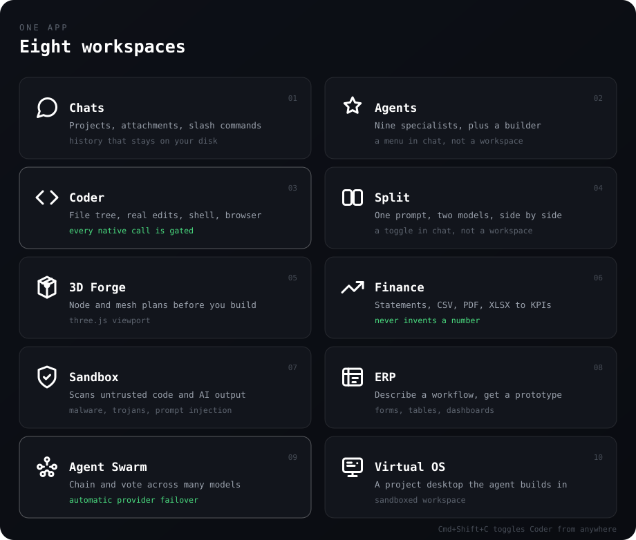
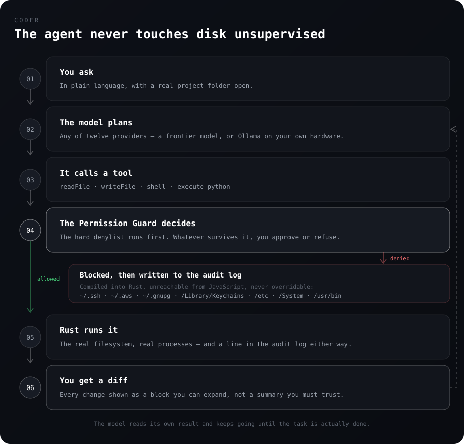
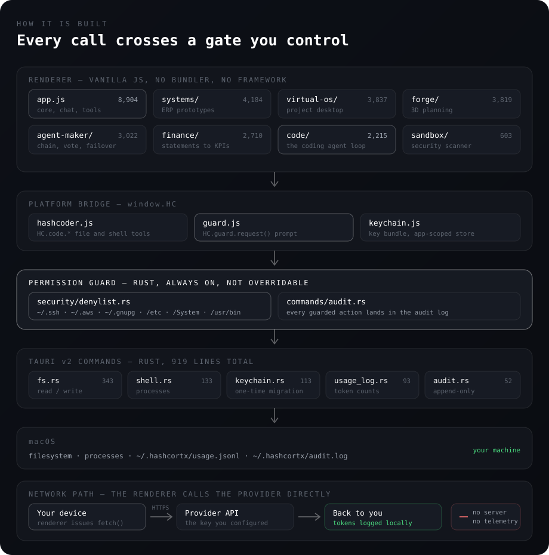

<div align="center">


# HashCortx

**A local-first AI workspace — multi-provider chat, an autonomous coding agent, and multi-agent swarms in one native desktop app.**<br>
**No backend. No telemetry. No account. MIT-licensed.**

<a href="https://github.com/Hash-7777/HashCortX/releases/latest"></a>
<a href="https://hashcortx.com"></a>
<a href="https://youtu.be/On5wPdKZDfg"></a>
<a href="https://github.com/Hash-7777/HashCortX/wiki"></a>
<a href="https://news.ycombinator.com/item?id=49516181"></a>
<a href="https://github.com/Hash-7777/HashCortX/discussions"></a>

<a href="https://github.com/Hash-7777/HashCortX/actions/workflows/ci.yml"></a>


<br>

<a href="https://trendshift.io/repositories/36185?utm_source=trendshift-badge&amp;utm_medium=badge&amp;utm_campaign=badge-trendshift-36185" target="_blank" rel="noopener noreferrer"></a>

</div>

<br>


---

## What this is

Eight workspaces — chat, an autonomous coding agent, multi-agent swarms, financial document analysis, a security scanner, a business-app builder, 3D planning and a virtual project desktop — behind one window, with nine specialist agents and a real Python sandbox working inside them.

Every AI request goes straight from your machine to the provider whose key you entered. Nothing passes through HashCortx infrastructure, because there is no HashCortx infrastructure. Point it at Ollama and it runs with the network off — everything except the Python sandbox, which fetches its runtime on first use.

| | |
|---|---|
| **Type** | Native desktop app (Tauri v2) |
| **Runs on** | macOS Apple Silicon — built and used daily. **Windows — tested on Windows 10**, with an installer in the release. Linux compiles and passes its tests in CI, but nobody has run the app there yet |
| **License** | MIT |
| **Latest release** | v2.6.0 (1 September 2026) — 43 MB DMG for Apple Silicon, 80 MB installed; 33 MB of that is the bundled embedding model and most of the rest is the runtime that executes it. Plus a 20 MB Windows program, built without that model so it starts on any 64-bit PC |
| **AI providers** | 11 cloud (Groq, Gemini, OpenAI, Anthropic, Moonshot, DeepSeek, Mistral, Cerebras, SambaNova, OpenRouter, NVIDIA NIM) + Ollama |
| **Stack** | Rust · vanilla JavaScript · no bundler · no framework · ~35,700 lines JS, ~4,530 Rust |
| **Tests** | 93 Rust tests, run by CI on Linux, macOS and Windows · 1,384 source checks, every one of them run by CI on every push |
| **Telemetry · backend · accounts** | None · None · None |

> **v2.6.0 is what this page describes.** It carries 112 commits since v2.5.0 — HashCortx running on Windows for the first time, and 3D Forge going from a demo to something that writes files a printer or a CAD program will accept. [What changed](CHANGELOG.md#260--2026-09-01), including what is still open.

---

## Why you might want it

**Nothing phones home.** No analytics, no crash reporting, no update pings. The only outbound connections are to providers you configured yourself.

**Your keys, your models.** Eleven cloud providers and Ollama, configured at once, switched freely, mixed inside a single swarm run.

**The agent asks before it acts.** File and shell calls hit a Rust permission gate and a compiled denylist that no prompt can talk its way past.

**Search that understands meaning.** Ask about "stopping a runaway command" and your notes about killing a process on timeout come back — from a model that ships inside the app and never sends anything anywhere.

**You can audit it.** MIT, no build step, no minified application code. Read it, fork it, ship your own.

---

## The eight workspaces



| | Workspace | What it does |
|---|---|---|
| 01 | **Chats** | Multi-provider chat with projects, attachments, slash commands, full history |
| 02 | **Coder** | The coding agent: file tree, real file edits, shell access, browser panel |
| 03 | **3D Forge** | Describe a part, get a dimensioned solid you can print. Fuses to one watertight body, cuts real holes, exports in millimetres |
| 04 | **Finance** | Statements, CSV, PDF and XLSX into KPIs and charts. Never invents a number |
| 05 | **Sandbox** | Agents scanning untrusted code for malware, prompt injection, suspicious logic |
| 06 | **ERP** | Describe a workflow, get a working interactive prototype |
| 07 | **Agent Swarm** | Chain mode, vote mode, automatic provider failover mid-run |
| 08 | **Virtual OS** | A simulated project desktop an agent works inside |

Two more surfaces are not workspaces and have no tab of their own: **Agents** — the nine built-in specialists and the builder for your own — opens as a menu over the message you are writing, and **Split** — one prompt, two models, streamed side by side — is a toggle inside chat.

The nine agents, the Python sandbox and every workspace in detail: [MODES_GUIDE.txt](MODES_GUIDE.txt) · [Wiki → Features](https://github.com/Hash-7777/HashCortX/wiki/Features)

---

## Coder

The agent reads your real files, edits them, runs commands, and shows every change as a diff you can expand. It does not get to do any of that quietly.



Every filesystem and shell call passes through `HC.guard.request()` and lands in Rust, where a compiled denylist refuses anything touching `~/.ssh`, `~/.aws`, `~/.gnupg`, the system directories, or HashCortx's own stored keys — whether the path arrives as a file operation or inside a shell command. Inside the folder you opened, the agent works without interrupting you. Outside it, everything asks first, **including reads**, because an agent that reads a file is an agent that can send it to a provider.

Every command is bounded: a five-minute timeout, closed stdin, a 512 KB output cap. Full detail, and the honest limits: [SECURITY.md](docs/SECURITY.md).

---

## Agent Swarm

Chain mode hands each agent's output to the next. Vote mode runs one prompt across several models and has a judge score the answers. If a provider rate-limits or dies mid-run, the swarm swaps to another one you configured and carries on with the same context.


---

## The knowledge base

Anything you ingest becomes searchable by **meaning**, not just by matching words — `bge-small-en-v1.5` (MIT) ships inside the app and runs natively in Rust. It is inference-only: a sentence encoder, not a language model. On an x86-64 machine without AVX2 the app is built without it and searches by keyword instead; see [Older processors](#older-processors-without-avx2).

- **Nothing is fetched.** No first-run download, no cache to warm. It works offline on first launch.
- **Nothing is sent.** What you index never crosses a network boundary.
- **34 MB of the download.** That is the price of the two lines above, paid once.

Results are ranked by meaning and by keyword at once, then fused — so a rare error code still finds its exact match while a paraphrased question still finds the right passage.

---

## Install

Download the DMG from the [latest release](https://github.com/Hash-7777/HashCortX/releases/latest), open it, drag HashCortx to `/Applications`.

The DMG is built for **Apple Silicon**. On an Intel Mac, build from source.

On **Windows** there is an installer in the [latest release](https://github.com/Hash-7777/HashCortX/releases/latest). It is the build made without local embeddings, so it starts on a processor of any age and searches the knowledge base by keyword rather than by meaning; for search by meaning on an AVX2 processor, build with the default features (below). On **Linux** there is no prebuilt download — build from source (below). Check your processor first: the default build needs AVX2 and BMI2, and there is a build that does not. See [Older processors](#older-processors-without-avx2).

The build is unsigned and not notarised, so on first launch right-click the app and choose **Open**, then **Open** again. If macOS still refuses:

```bash
xattr -dr com.apple.quarantine /Applications/HashCortx.app
```

Then open **Settings → API keys**, add a key, press **Test**. Or skip keys entirely and run a model on your own machine — **Settings → Local model** walks you through it and checks each step for you.

### Build from source

```bash
cd ~                   # start in your own folder, not wherever the shell opened
git clone https://github.com/Hash-7777/HashCortX.git
cd HashCortX
npm install
npm run tauri dev      # live-reload development
npm run tauri build    # DMG in src-tauri/target/release/bundle/dmg/
```

Node 18+ and a Rust toolchain via `rustup`, plus **macOS**: Xcode Command Line Tools · **Linux**: Ubuntu 24.04+ and the Tauri v2 system libraries (glibc 2.38+ is required to link the bundled ONNX Runtime) · **Windows**: MSVC build tools and WebView2.

**On Windows, run `cd ~` before cloning — the line above is not decoration.**
PowerShell opened as an administrator starts in `C:\Windows\System32`, so a
pasted `git clone` lands inside Windows' own system folder. The prerequisite
installers want an administrator window; the build itself does not, and a normal
PowerShell already starts somewhere sensible.

A checkout under `System32` fails in a way that points nowhere near the cause.
The WiX tools Tauri bundles with are 32-bit, and a 32-bit process reading that
path is redirected by Windows to `SysWOW64`, where the checkout does not exist —
so the Rust build succeeds and bundling then fails saying it cannot find a file
that is plainly there. The folder also inherits System32's permissions, so
getting rid of it afterwards needs an administrator:

```powershell
robocopy C:\Windows\System32\HashCortX $HOME\HashCortX /E /XD target
Remove-Item -LiteralPath C:\Windows\System32\HashCortX -Recurse -Force
```

### Older processors (without AVX2)

The default build links a prebuilt ONNX Runtime for the embedding model. It is
compiled for x86-64 processors with **AVX2 and BMI2** — Intel Haswell (2013),
AMD Excavator (2015) and newer — and it is linked statically, so its start-up
code runs before `main()`. On an older processor it executes an instruction the
CPU does not have and the process is killed while it is still loading: no
window, no error, nothing on screen.

Build without it, and the app starts on any x86-64 machine:

```bash
npx tauri build -- --no-default-features
```

The `--` matters: the Tauri CLI has no such flag of its own and passes
everything after it to cargo. Through an npm script it takes two, because npm
eats the first one — `npm run tauri build -- -- --no-default-features`.

That build has no embedding model in it. The knowledge base still works and
still searches, by keyword rather than by meaning; `embed_available` reports
false so the interface can say so rather than quietly returning worse results.
The binary is also far smaller — about 20 MB against about 80 MB, measured on
Apple Silicon — since neither the model nor the runtime is compiled in. Apple
Silicon is unaffected either way.

Before pushing, run what CI runs:

```bash
npm run check                                     # 2,968 checks over the real source
cargo test --manifest-path src-tauri/Cargo.toml   # 97 tests
```

---

## Under the hood



| Layer | Technology |
|---|---|
| **Shell** | Tauri v2 — Rust core, the system webview, no Chromium |
| **Backend** | Rust: filesystem, shell, audit log, usage log, embeddings, Keychain migration |
| **Security** | Compiled denylist in `security/denylist.rs`, permission prompt via `HC.guard.request()` |
| **Frontend** | Vanilla JavaScript. No React, no TypeScript, no bundler, no build step |
| **Embeddings** | bge-small-en-v1.5 (MIT) compiled into the binary, run via ONNX Runtime |
| **Python** | Pyodide (CPython on WebAssembly) with pandas, numpy, matplotlib, python-docx, openpyxl, reportlab |
| **Vendored libs** | marked, highlight.js, DOMPurify, mermaid, pdf.js, jsPDF, three.js — all local, no CDN |

No bundler is a deliberate constraint. The interface is about 2.5 MB of source that ships as written, so any reader can follow a feature from the button that triggers it to the Rust function that performs it, without a source map. What makes the download large is the embedding model and the runtime that executes it, not the app.

[ARCHITECTURE.md](docs/ARCHITECTURE.md) · [SECURITY.md](docs/SECURITY.md) · [CONTRIBUTING.md](CONTRIBUTING.md) · [CHANGELOG.md](CHANGELOG.md)

---

## Privacy and security

**No backend, no telemetry, no accounts, no auto-updater.** The binary makes no network call except to the provider endpoints you set up.

**A permission gate in Rust.** Sensitive paths are denied unconditionally, whether they arrive as a file operation or inside a shell command. Every guarded action is logged to `~/.hashcortx/audit.log`.

**Keys are not encrypted.** They sit in an app-scoped local directory protected by your user account, not by Keychain encryption — because a Keychain item's access list is bound to the code signature, and an unsigned build would re-prompt for every key on every update. Code signing is on the roadmap; the reasoning is written out in full in [SECURITY.md](docs/SECURITY.md).

**Measured usage, not guessed.** One JSON line per response to `~/.hashcortx/usage.jsonl` — timestamp, model id, token counts. No prompt, no answer, no file names. Counts come from the provider's own metadata; if a provider reports none, HashCortx writes nothing rather than estimating. [HashMeterAi](https://github.com/Hash-7777/HashMeterAi) reads that file if you install it.

```bash
jq -s 'map(.input_tokens + .output_tokens) | add' ~/.hashcortx/usage.jsonl
```

**Source-grounded modes.** Published Papers Researcher, Medical Lexi-Check and Finance are constrained never to fabricate data.

---

## How it compares

Best effort as of August 2026. If something is out of date, [open an issue](https://github.com/Hash-7777/HashCortX/issues/new/choose).

| | HashCortx | Cursor | Claude Code | Continue | Aider | Cline | Zed |
|---|---|---|---|---|---|---|---|
| Type | Native app | VS Code fork | CLI | Extension | Terminal CLI | Extension | Native editor |
| License | MIT | Proprietary | Proprietary | Apache 2.0 | Apache 2.0 | Apache 2.0 | GPL/AGPL |
| Free | Bring your own key | Subscription | Subscription or API | Yes | Yes | Yes | Yes |
| Cloud providers | 11 | Limited | Anthropic only | Many | Many | Many | Several |
| Local models (Ollama) | Yes | Limited | No | Yes | Yes | Yes | Yes |
| Multi-agent swarms | Yes | No | No | No | No | No | No |
| Workspaces beyond coding | 8 | No | No | No | No | No | No |
| Built-in specialist agents | 9 | None | None | None | None | None | None |
| Telemetry | None | Yes | Opt-out | Opt-in | None | None | Opt-in |

---

## FAQ

**Is it free?** Yes. MIT, no paid tier, no usage caps. You pay the AI providers directly, or nothing at all with Ollama.

**Does it work offline?** Yes, with Ollama. The knowledge base works offline regardless. Cloud providers need the internet.

**Which systems?** macOS Apple Silicon is built and used daily. **Windows runs — tested on Windows 10**, where the app has been built, installed and used; that release carries a Windows installer. Linux compiles and passes its tests in CI on every push, but nobody has launched it there, so treat Linux as buildable rather than supported.

**What processor does it need?** On x86-64 — every Windows and Linux machine, and Intel Macs — the default build needs **AVX2 and BMI2**: Intel Haswell (2013) or AMD Excavator (2015) and newer. That is not the app itself but the ONNX Runtime it links to run the embedding model, which is compiled for those instructions and starts up before any of the app's own code. On an older processor the app cannot start at all, and because the failure happens during loading there is no window and no message — a double-click that appears to do nothing. Building with `--no-default-features` removes that runtime and produces an app that starts on any x86-64 machine; see [Older processors](#older-processors-without-avx2). Apple Silicon is unaffected.

**Does it send my code anywhere?** Only to the provider you configured, when you send a message. There is no HashCortx server.

**Are my API keys encrypted?** No — see above.

**Was it built with AI?** Yes, heavily. Roughly 30 million tokens across Claude, GPT and other frontier models during the v2.0.0 build, and substantially more over the 253 commits since, under human architecture, review and correction. Disclosed because HashCortx is itself an AI tool, and hiding that would be incoherent. Every product decision — the workspace structure, the local-first rule, the Permission Guard, the swarm failover pattern, the source-grounding constraints — is the author's.

More at [Wiki → FAQ](https://github.com/Hash-7777/HashCortX/wiki/FAQ).

---

## Roadmap

- A release cut from `main`, so the download matches this README
- Code signing and notarisation, which also unlocks Keychain key storage
- Someone actually running the app on Linux and Windows — compiling and passing tests is not the same thing
- Continued extraction of `app.js` into focused modules
- Permission Guard coverage for Virtual OS and 3D Forge
- Reaching the knowledge base from Coder mode, which still cannot see it

Suggest something in [Issues](https://github.com/Hash-7777/HashCortX/issues/new/choose) or [Discussions](https://github.com/Hash-7777/HashCortX/discussions).

---

## The Hash ecosystem

Four local-first apps, same principles — no cloud, no telemetry, your data stays where it is.

| App | What it is | Licence |
|---|---|---|
| **HashCortx** *(you are here)* | The local-first AI workspace | MIT |
| [**HashCerebrum**](https://github.com/Hash-7777/HashCerebrum) | Medical research workbench with a 3D brain interface | AGPL-3.0 |
| [**HashMeterAi**](https://github.com/Hash-7777/HashMeterAi) | An honest local meter for how much AI you actually use | Apache-2.0 |
| [**HashNotch**](https://github.com/Hash-7777/HashNotch) | Turns the MacBook notch into a live activity island | GPL-3.0 |

They interlock, through files on your disk rather than a service:

- HashCortx appends real token counts to `~/.hashcortx/usage.jsonl`, and **HashMeterAi** reads it — so your spend across every tool is measured in one place, by software that never phones home.
- When a run finishes, HashCortx posts a short notice to `~/.hashnotch/activities.json`, and **HashNotch** lights up the notch — a title and nothing else, never a model name, a prompt or an answer. If it is not installed, the file simply sits there unread.

---

## Keyboard shortcuts

`Cmd/Ctrl + Shift + C` toggle Coder · `Cmd/Ctrl + Shift + N` new chat · `Cmd/Ctrl + K` model picker

---

**Author** — [Seif Hashish](https://github.com/Hash-7777), independent open-source developer with a pharma and clinical background, which is where the refusal-to-fabricate constraints in the medical and finance modes come from. · [hashcortx.com](https://hashcortx.com)

**License** — MIT. See [LICENSE](LICENSE).

<div align="center">

<br>

**HashCortx** · One window · Twelve providers · Zero data leak · Local-first · MIT

[Download](https://github.com/Hash-7777/HashCortX/releases/latest) · [Wiki](https://github.com/Hash-7777/HashCortX/wiki) · [Discussions](https://github.com/Hash-7777/HashCortX/discussions)

<br>

</div>
