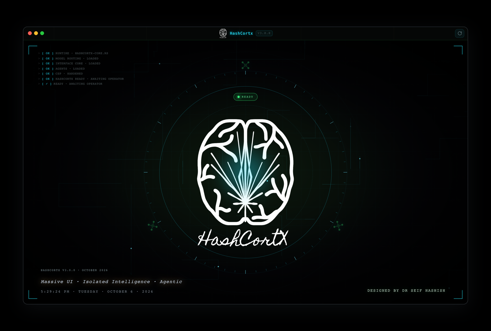
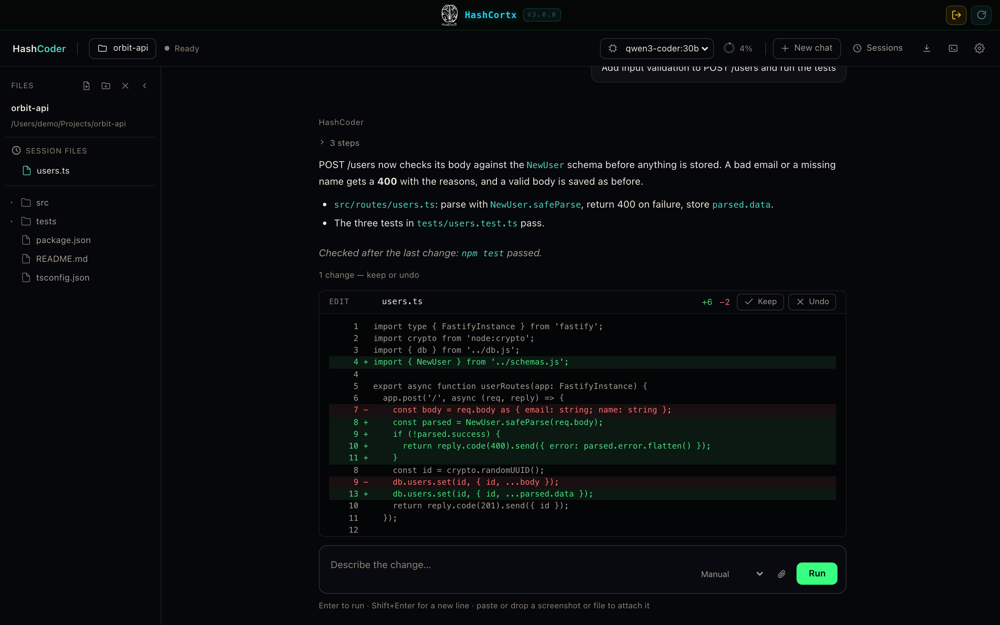
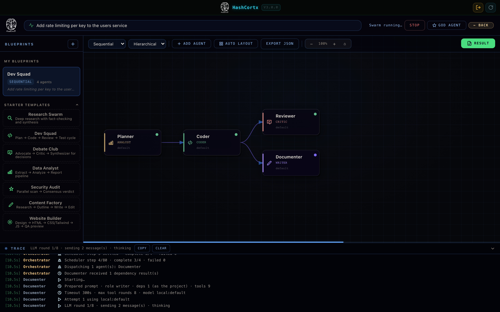
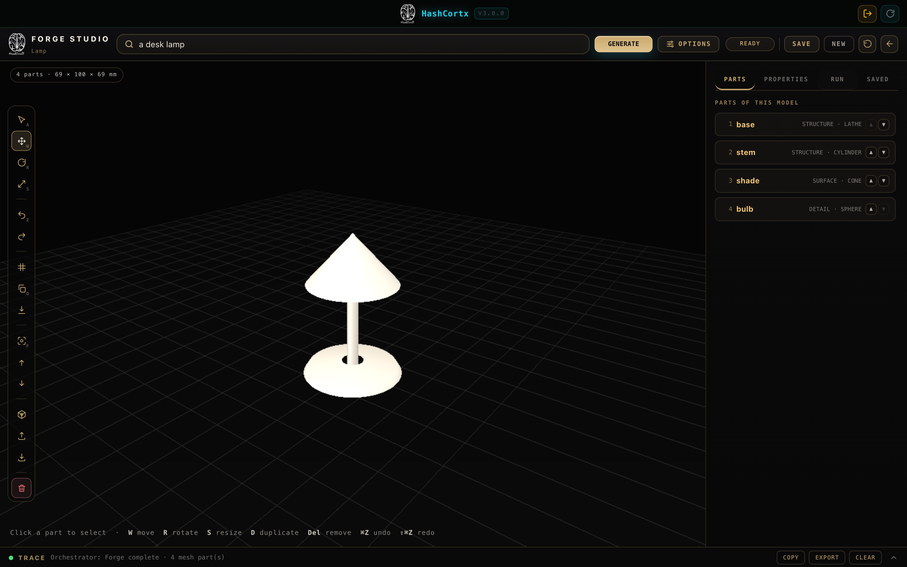
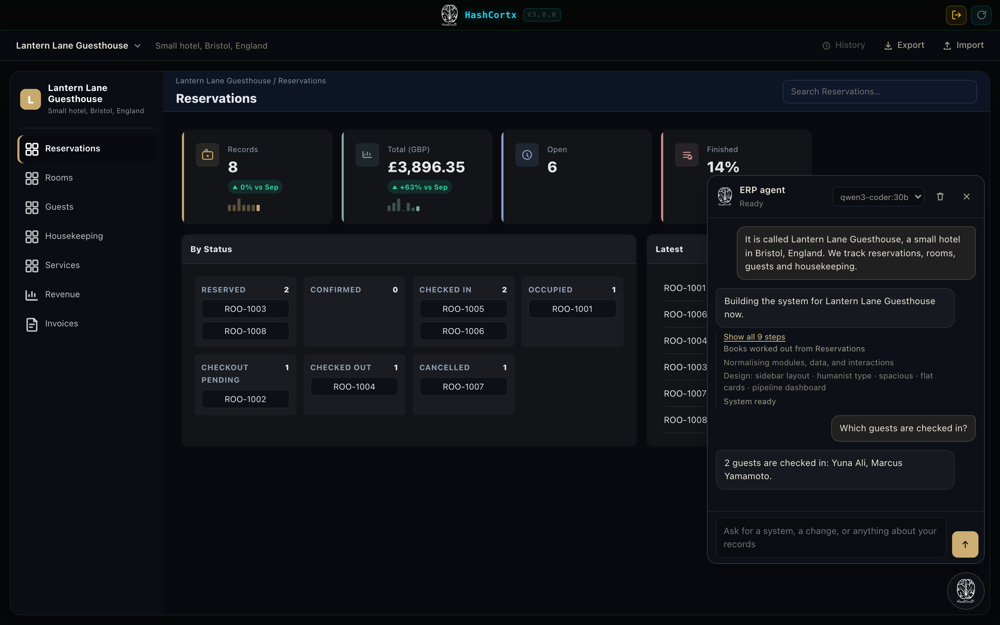

<div align="center">


# HashCortx

### Every AI model. One desktop. Nothing leaves without you.

Chat, a coding agent, agent teams, a 3D CAD forge and an ERP builder,<br>
on your keys and your machine. No backend, no telemetry, no account.

**In the making since 1 May 2026.**

<a href="https://github.com/Hash-7777/HashCortX/releases/latest"></a>
<a href="https://hashcortx.com"></a>
<a href="https://youtu.be/On5wPdKZDfg"></a>
<a href="https://github.com/Hash-7777/HashCortX/wiki"></a>
<a href="https://news.ycombinator.com/item?id=49516181"></a>
<a href="https://github.com/Hash-7777/HashCortX/discussions"></a>

<a href="https://github.com/Hash-7777/HashCortX/actions/workflows/ci.yml"></a>


<br>

<a href="https://trendshift.io/repositories/36185?utm_source=trendshift-badge&amp;utm_medium=badge&amp;utm_campaign=badge-trendshift-36185" target="_blank" rel="noopener noreferrer"></a>

</div>

<br>



<br>

| | |
|---|---|
| **Nothing phones home** | No analytics, no crash reports, no update checks. Every connection is for work you asked for, and [SECURITY.md](docs/SECURITY.md) lists each address. |
| **Every model, side by side** | Eleven cloud providers, Ollama, and any local model app that speaks the common chat format, with your own keys. Fully local whenever you want. |
| **An agent that asks first** | Commands, deletions, web pages and anything outside your project wait for your yes. Every file change is a diff you can keep or undo. |
| **Readable to the last line** | MIT. Vanilla JavaScript and Rust, no bundler, no minified app code. |

> This page describes `main`. What changed since v2.6.0 reaches the download with the next release; the [changelog](CHANGELOG.md) lists it.

## Eight workspaces

| | |
|---|---|
| **Chats** | Every provider in one conversation, with projects, attachments, memory and a local knowledge base |
| **HashCoder** | A coding agent on your real project: file tree, diffs, terminal, Undo |
| **Agent Swarm** | Teams of agents on any mix of models, built on a canvas or designed from your task |
| **3D Forge** | Describe a part, get a dimensioned solid. STL, OBJ, 3MF and STEP, in millimetres |
| **ERP** | Describe your business; its agent builds a working app with records, stages and books, exported as one HTML file |
| **Finance** | Statements, CSV, PDF and XLSX read into figures, every total and chart worked out by the app |
| **Sandbox** | Agents that inspect untrusted code for malware, prompt injection and suspicious logic |
| **Virtual OS** | A simulated desktop an agent builds a project inside |

Plus **Agents**, nine built-in specialists and a builder for your own, **Split**, one prompt answered by two models side by side, and **Connections**: a business system you connect over MCP (Odoo, GitHub, Stripe and Supabase are ready-made), whose key never reaches a page or a model and whose every change asks you first. [How](docs/SECURITY.md#connected-systems).

## HashCoder

It works on your real files. Every edit is a diff with **Keep** and **Undo**, tests run in the built-in terminal, and screenshots, PDFs and files attach by paste or drop.

- **Proves its work.** It runs your tests after a change, reads a website the way a browser would before calling it done, and sends itself back for what it left unfinished: a renamed name still written somewhere, files that do not load each other, the example your request gave.
- **Fits the model.** Cloud models get a map of your code; small local models get a light mode that writes whole files while HashCoder does the tool work.
- **Keeps what you did not ask to change.** An edit that drops a function, a section or a heading is sent back, and what you say to leave alone is left alone.



## Agent Swarm

Build a team on a canvas, start from a template, or describe the task and have one designed, sized to the job. Watch every agent in the live trace, then open the result: each agent's part, the files it made and every version of them. Agents that did not finish can be run again on their own. A website a team builds can show real, openly licensed photographs, credited on the page.



<table>
<tr>
<td width="50%"></td>
<td width="50%"></td>
</tr>
<tr>
<td><b>3D Forge.</b> A described object becomes real parts with real dimensions, ready to print or open in CAD.</td>
<td><b>ERP.</b> Tell the agent about your business and it builds the app. Ask it to change the app, record what happened, or answer from your records.</td>
</tr>
</table>

## Security, stated plainly


- **You approve what matters**, and every decision is written to `~/.hashcortx/audit.log`.
- **A blocklist compiled into Rust** refuses keys, credentials and system folders, as files or inside commands.
- **On macOS, agent commands run in the system sandbox**, kept out of your keys, keychains, shell start-up files and the app's own data.
- **A task on a local model stays local**, and cloud requests are capped at 30 a minute and 6 at once.
- **What it is not:** keys are stored unencrypted, protected by your user account, and the build is not code-signed.

Everything it does, and does not, is in [SECURITY.md](docs/SECURITY.md).

## Install

**macOS (Apple Silicon).** Download the DMG from the [latest release](https://github.com/Hash-7777/HashCortX/releases/latest) and drag HashCortx to Applications. The build is not notarised: on first launch, right-click the app, choose **Open**, then **Open** again. If macOS still refuses:

```bash
xattr -dr com.apple.quarantine /Applications/HashCortx.app
```

**Windows.** Run the installer from the [latest release](https://github.com/Hash-7777/HashCortX/releases/latest). It is built without the embedding model, so it starts on any 64-bit PC and searches the knowledge base by keyword.

**Linux and Intel Macs.** Build from source, below.

Then open **Settings → API keys**, add a key and press **Test**, or run a model on your own machine with **Settings → Local model**.

<details>
<summary><b>Build from source</b></summary>

<br>

```bash
cd ~
git clone https://github.com/Hash-7777/HashCortX.git
cd HashCortX
npm install
npm run tauri dev      # develop
npm run tauri build    # package
```

Needs Node 18+ and Rust via `rustup`, plus **macOS:** Xcode Command Line Tools · **Linux:** Ubuntu 24.04+ with the Tauri v2 system libraries · **Windows:** MSVC build tools and WebView2.

**On Windows, run `cd ~` first.** An administrator PowerShell starts in `C:\Windows\System32`, and a checkout there fails to bundle with a misleading "file not found".

**On Windows, allow the app in Ollama.** The app's page comes from `http://tauri.localhost`, which Ollama refuses until it is allowed. Run `setx OLLAMA_ORIGINS "http://tauri.localhost"` and reopen Ollama; until then the app says that the local model app refused it.

**Older x86-64 processors (without AVX2).** The default build links an ONNX Runtime that needs AVX2 and BMI2 (Intel Haswell, AMD Excavator and newer); an app built with it closes before a window appears on an older processor. Building on such a processor stops with a message that says so. Build without the embedding model instead, and search falls back to keywords:

```bash
npx tauri build -- --no-default-features
npm run tauri dev -- -- --no-default-features     # and to develop
```

Before a pull request, run what CI runs on Linux, macOS and Windows:

```bash
npm run check                                     # 10,053 source checks
cargo test --manifest-path src-tauri/Cargo.toml   # 222 Rust tests
```

Tauri v2 · Rust · vanilla JavaScript with no bundler, served as written.
[Architecture](docs/ARCHITECTURE.md) · [Security](docs/SECURITY.md) · [Contributing](CONTRIBUTING.md) · [Changelog](CHANGELOG.md)

</details>

## FAQ

**Is it free?** Yes. MIT, no paid tier. You pay your AI providers directly, or nothing with a local model.

**Does it work offline?** Yes, with Ollama or another local model app. Web search, cloud models and the Python sandbox's first start need the internet.

**Which systems?** macOS on Apple Silicon, built and used daily. Windows 10, tested. Linux builds and passes CI, but has not been run by anyone yet.

**Does my code leave my machine?** Only inside a request to the model you chose. There is no HashCortx server.

**Are my keys encrypted?** No. They sit in the app's own folder, protected by your user account. [Why](docs/SECURITY.md#where-api-keys-live).

**Was it built with AI?** Yes, with AI coding models under human architecture, review and correction. Every product and security decision is the author's.

More in the [Wiki](https://github.com/Hash-7777/HashCortX/wiki/FAQ).

| Shortcut | Action |
|---|---|
| `Cmd/Ctrl + Shift + C` | Open or leave HashCoder |
| `Cmd/Ctrl + Shift + N` | New chat |
| `Cmd/Ctrl + K` | Model picker |

## The Hash ecosystem

| App | What it is | Licence |
|---|---|---|
| **HashCortx** *(you are here)* | The local-first AI workspace | MIT |
| [**HashCerebrum**](https://github.com/Hash-7777/HashCerebrum) | Medical research workbench with a 3D brain interface | AGPL-3.0 |
| [**HashMeterAi**](https://github.com/Hash-7777/HashMeterAi) | An honest local meter for your AI usage | Apache-2.0 |
| [**HashNotch**](https://github.com/Hash-7777/HashNotch) | Turns the MacBook notch into a live activity island | GPL-3.0 |

They connect through files on your disk, not a service: HashCortx records token counts in `~/.hashcortx/usage.jsonl` for **HashMeterAi**, and posts a short "finished" notice, a title and never a prompt or an answer, for **HashNotch**.

<br>

<div align="center">

**HashCortx** · since 1 May 2026 · by [Seif Hashish](https://github.com/Hash-7777) · [MIT](LICENSE)

[Download](https://github.com/Hash-7777/HashCortX/releases/latest) · [Website](https://hashcortx.com) · [Wiki](https://github.com/Hash-7777/HashCortX/wiki) · [Discussions](https://github.com/Hash-7777/HashCortX/discussions)

</div>
